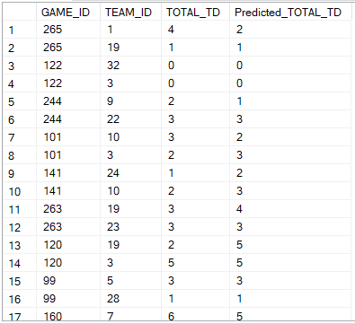

# SQL Server Machine Learning - NFL Example
Some SQL server machine learning services code

This is based on the Iris tutorial that Microsoft provides at <https://docs.microsoft.com/en-us/sql/advanced-analytics/tutorials/quickstart-python-train-score-model?view=sql-server-ver15>

The input data looks like the following  

The predictions look like the following  

## Data Source

The source data and load scripts can be found in the data directory.  
